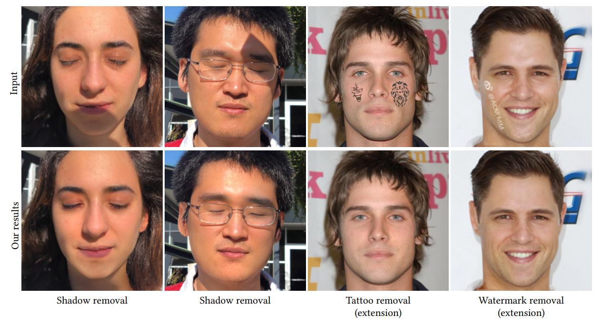
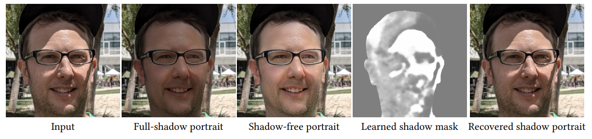

# ShadowGP


**This repository includes official codes for "[Unsupervised Portrait Shadow Removal via Generative Priors (ACM MM 2021)](https://arxiv.org/abs/)".** 
> **Unsupervised Portrait Shadow Removal via Generative Priors** <br>
>  Yingqing He*, Yazhou Xing*, Tianjia Zhang, Qifeng Chen (* indicates joint first authors)<br>
>  HKUST <br>

[[Paper](https://arxiv.org/)] 
[[Project Page](TBA)]
[[Technical Video (Coming soon)](TBA)]


In this repository, we propose an unsupervised method for portrait shadow removal, named as ShadowGP. ShadowGP can recover a shadow-free portrait image via single image optimization, without a large paired training dataset, which is expensive to collect and time-consuming to train. Besides, our method can also be extended to facial tattoo removal and watermark removal tasks.   

<!-- **Figure:** *Our results* -->
<!-- <br />     -->
ShadowGP can decompose the **single input shadowed portrait image** into **3 parts: a full-shadow portrait, a shadow-free portrait and a shadow mask**. Blending the three parts together can reconstruct the input shadowed portrait. The decomposed shadow-free portrait is the target output.  

<!-- **Figure:** *Our unsupervised method takes a single shadow portrait as input and can decompose it into a shadow-free portrait image, a full-shadow portrait image, and a shadow mask* -->


## Code will come soon.
<br />

## Citation

```
@inproceedings{he21unsupervised,
  title     = {Unsupervised Portrait Shadow Removal via Generative Priors},
  author    = {He, Yingqing and Xing, Yazhou and Zhang, Tianjia and Chen, Qifeng},
  booktitle = {ACM International Conference on Multimedia (ACM MM)},
  year      = {2021}
}
```
